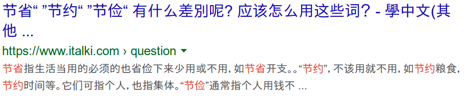

+++
date = "2019-11-05"
title = "Differentiating Similar Words in Mandarin"
description = "A simple trick to find the difference between similar words in Mandarin"
[taxonomies]
tags = ["mandarin"]
+++

When learning Mandarin, I often encounter vocabulary with an identical English translation.
As an example, Pleco gives "frugal" as the meaning of 節省, 節儉, and 節約.
Yet, native speakers use these words in different contexts.

How can you find out where the differences are? And when should you use which word?
Below I'll share my answer to these questions.

## Google it in Mandarin

To keep it short, my solution is to **google it in Mandarin.**

If you want to know the difference between characters X and Y, search for:

> X Y 差別

Let's see what we get for the words above.

Running a search for "節省 節儉 節約 差別" gets us the following:

Clicking on the [link](https://www.italki.com/question/274511?hl=zh-tw) leads to a page with the following explanation[^1]:

> 節省指生活當用的必須的也省儉下來少用或不用，如節省開支。“節約”，不該用就不用，如節約糧食，節約時間等。它們可指個人，也指集體。“節儉”通常指個人用錢不浪費，不包括人力、時間在內，如生活很節儉

We learn that 節省 means to economize things in your daily life, like 節省開支 (cutting down on your expenses).

Additionally, we see that 節約 is used for being thrifty with things that are rationed because there isn't enough, such as 節約糧食 (rationing food).

節儉 is used for money. So you could use it to describe that someone lives a very thrifty lifestyle: 生活很節儉.

### Prerequisites

To use this tip you have to be able to read and type Chinese characters.
If you're not there yet, it's best to find a native speaker who can answer your question.
You can also go to [italki](https://www.italki.com/?hl=de) and ask your question in English.

Most search results will be in simplified characters.
I'm learning traditional characters. That's why I had a hard time using this technique in the beginning.
If you're having trouble reading one or the other character set, there are a lot of converters all over the internet.
I use [this one](https://www.chinese-tools.com/tools/converter-simptrad.html).

[^1]: I converted this quote to traditional characters for my own convenience.
