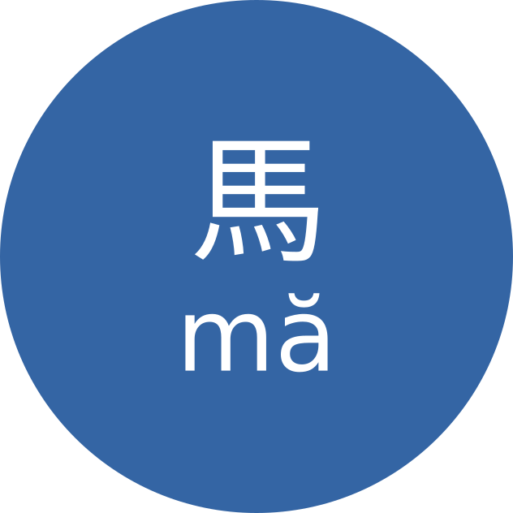
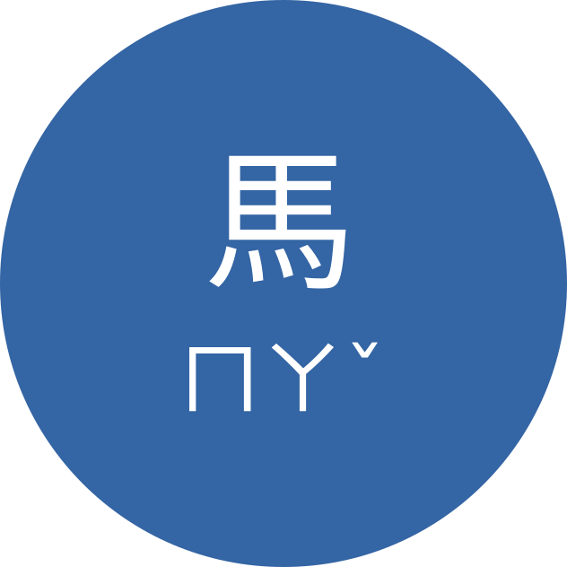

+++
date = "2020-08-07"
title = "I ❤️ Bopomofo"
description = "and you should too!"
[taxonomies]
tags = ["mandarin"]
[extra]
image = "bopomofo_character.png"
+++

Like most Mandarin learners, the first [transliteration](https://en.wikipedia.org/wiki/Transliteration) system I learned was Pinyin.

From the beginning, I had difficulties with it.
Some transliterations just didn't make sense to me.

The biggest issue for me was that Pinyin uses Latin letters.
Whenever I opened Pleco, my eyes were drawn to familiar characters, which made it harder to focus on Chinese characters.

After spending time in Taiwan, I realized there are other transliteration systems.
My favorite is Bopomofo.

In this post, I explain why I like it so much and why you should give it a try.

# What is Bopomofo

[Bopomofo](https://en.wikipedia.org/wiki/Bopomofo) (also called Zhuyin 注音) is a transliteration system for Mandarin Chinese.
The name comes from the first four Zhuyin symbols:
- ㄅ (bo)
- ㄆ (po)
- ㄇ (mo)
- ㄈ (fo)

In total, Bopomofo has 37 symbols and four tone marks, enough to transcribe all Mandarin sounds.

So what makes it so good for learners?

# If your native language uses Latin letters, Bopomofo can be better

## Distraction by Latin characters

For me, one of Pinyin's biggest drawbacks is that it uses Latin letters.
At first this sounds convenient, but it creates two distractions.

### Preconceived sound from Latin letters

My native language is German.
When I see something like `xue`, my brain already expects a certain sound.
That subconscious mapping gets in the way when learning Mandarin pronunciation.

Using a separate symbol system avoids this conflict.

### Visual distraction

Whenever I opened Pleco, my eyes jumped straight to Pinyin.
Even if I tried to read characters first, my attention went to Latin text.
Bopomofo helps by using a separate alphabet.

Try it yourself and notice where your eyes go first.

Now compare it with Bopomofo:

In the beginning, this may feel slower—and that's actually useful.
Because transliteration is slower to read, you'll rely on it less and focus more on characters.

## More concise character input

With Pinyin keyboard input, you usually cannot include tone in the same way.
That can lead to long candidate lists.

Example: entering `biao` to find 錶 (biao3) may show many candidates first.
If your target is far down the list, you need extra paging.

With Bopomofo, you can include tone in input.
For 錶, entering `ㄅㄧㄠˇ` narrows candidates quickly because syllable+tone is more specific.

## Part of Taiwanese culture

For Mandarin learners in Taiwan, there is another reason: Bopomofo is part of daily life.
You'll see it on signage, in phonetic annotations, and in Taiwanese contexts.

If you live in Taiwan and don't know Bopomofo, you miss part of the language environment.
In my experience, many Taiwanese speakers are also more comfortable helping with Zhuyin than with Pinyin.

# How long does it take to switch?

Switching takes some time.
I learned the alphabet with [this video](https://www.youtube.com/watch?v=lqa2QngzEis), which took me around six hours.

After that, I switched my phone input method to Bopomofo.
Input speed felt comparable to my previous Pinyin speed after about two weeks.

## How to switch your phone input method

### Android

I use [Gboard](https://play.google.com/store/apps/details?id=com.google.android.inputmethod.latin).
Install Zhuyin keyboard in settings and start using it.

### Apple

I don't use Apple devices myself, but my girlfriend likes [小麥注音輸入法](https://mcbopomofo.openvanilla.org/).

## What about Pleco?

[Pleco](https://www.pleco.com/) has excellent Bopomofo support.

Enable it at:

`Settings -> Language -> Mandarin -> Mandarin pronunciation`

# Conclusion

Now you know why I find Bopomofo superior to Pinyin for my own learning workflow.
If you think I missed something, let me know.

I hope this helps your Mandarin learning journey.