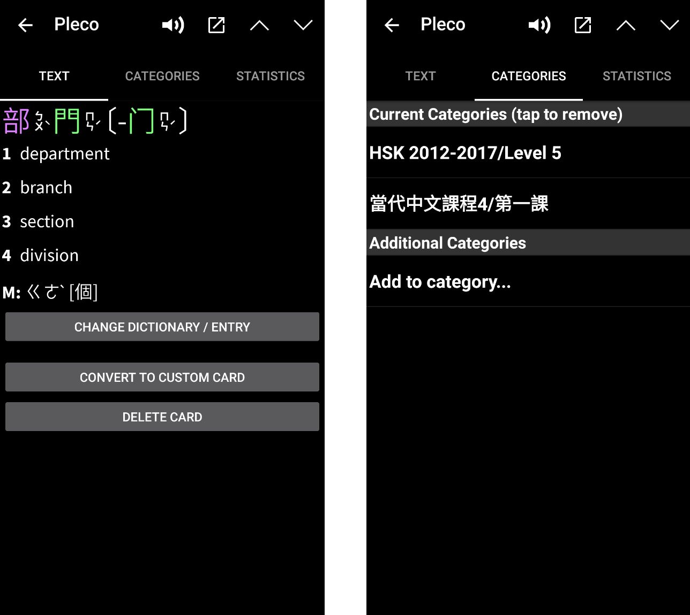
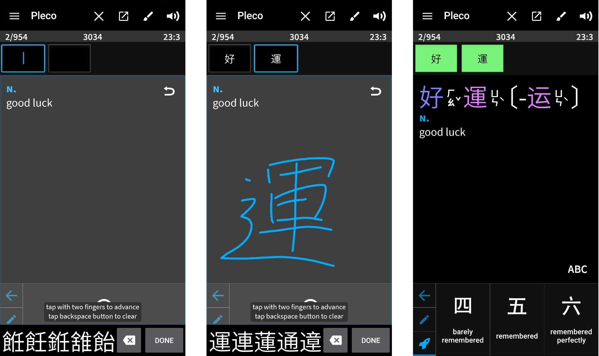
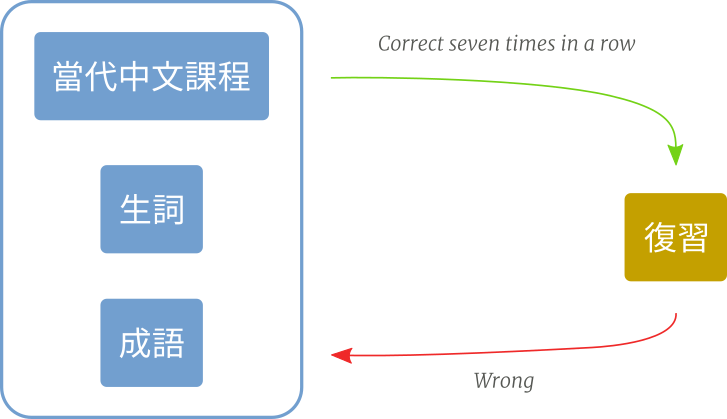
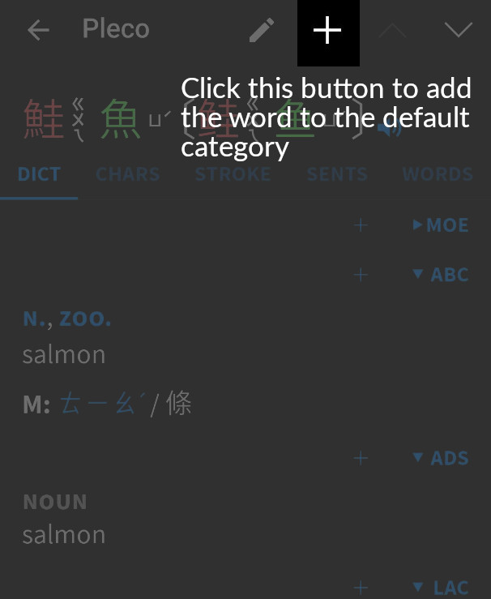

+++
date = "2020-07-08"
title = "My Pleco Flashcard Setup"
description = "How I use Pleco's flashcard feature to practice Mandarin"
[taxonomies]
tags = ["mandarin"]
[extra]
image = "vocabulary_movement.png"
+++

Ever since I started learning Mandarin, I have been using [Pleco](https://www.pleco.com).
For most Mandarin learners I've met, it's the most important learning tool.

Apart from its dictionary, I use Pleco for learning flashcards.
The way I use the flashcard feature evolved over time, and this setup currently helps me learn new words faster.

In this post you'll learn:
- the different test profiles I use
- how I customize Pleco's scoring algorithm

First, let's look at how Pleco's flashcard system works.

# Pleco's flashcard feature

## Categories

Categories are Pleco's way of organizing flashcards.
Each card can belong to one or more categories.

Whenever you look at a word in Pleco's dictionary, there is a plus icon at the top of the screen.
Clicking this icon adds the card to the default category.
Holding it lets you choose specific categories.

Pleco comes with categories for all HSK levels.
I added categories for each chapter of my textbook so I can target vocabulary by lesson.

Below is an example of a flashcard that belongs to two categories:
- HSK level 5
- lesson 1 of [A Course in Contemporary Chinese (當代中文課程)](https://mtc.ntnu.edu.tw/eng/book/A_Course_in_Contemporary_Chinese.html)

## Test profiles

Next are test profiles.
They define how you test your flashcard knowledge.

If you go to:

`Flashcards -> New Test -> Profile`

Pleco shows the default profile selection.
There is a lot of room for customization.

One of the most important options is **test type**.
It determines the learning interaction.

### Which test type I use

Pleco offers [six test types](https://iphone.pleco.com/manual/30200/flash.html#sessiontypeinterfaces), for example *Review only* and *Multiple-choice*.

My favorite is **Fill-in-the-blanks**.
I configure it so Pleco shows the definition and I enter the characters.
While entering, I think through tones and pronunciation and compare against the correct answer.

This lets me test multiple aspects at once:
- pronunciation and tones
- character recall and writing input
- listening (Pleco plays the dictionary audio afterwards)

Below is the progression through the test:
- **Left**: English definition shown, app prompts for characters
- **Middle**: I draw characters and think through tones/syllables
- **Right**: after filling all blanks, I grade recall quality

To improve learning, I added custom test profiles.

# My learning profiles

My workflow uses four profiles:
- `當代中文課程`: vocabulary from my textbook
- `生詞`: words I encounter while reading/listening
- `成語`: chengyu I want to learn
- `復習`: long-term review of learned words

A new card first goes into one of `當代中文課程`, `生詞`, or `成語`.
Before it can move to `復習`, I require at least **seven correct recalls in a row**.
I started with three, but forgot words too quickly, so I raised it to seven.

## 當代中文課程 - Textbook lessons

I use [A Course in Contemporary Chinese - 當代中文課程](https://mtc.ntnu.edu.tw/eng/book/A_Course_in_Contemporary_Chinese.html) as my main source for new words.

Typical workflow:
1. Add all words from the current lesson into Pleco, e.g. `當代中文課程/第一課`.
2. Review daily with two checks:
   - correct at least seven times in a row
   - not reviewed in the last 24 hours

The 24-hour filter forces repetition across multiple days.
Without it, I might get a card right several times in one day but still forget it later.

For new words, I deliberately repeat all cards instead of relying purely on spaced repetition.
This gives me better control over when a word feels truly learned.

## 生詞 - Words encountered in the wild

Learning only from textbooks is not enough.
When reading Mandarin news/articles, I keep adding useful words via the plus icon.

Then I run a test that:
- selects cards not reviewed in the last 24 hours[^1]
- sorts descending by score
- presents batches of 20 cards
- uses *Fill-in-the-blanks*

Sorting by score means I see cards I've seen before first (higher chance of successful recall).

A drawback: sometimes the second exposure to a new word comes too late, and by then I forgot it.
I am still experimenting with better handling for truly new words.

## 成語 - Chengyu

This profile is for [chengyu](https://en.wikipedia.org/wiki/Chengyu) I want to actively use.
I am selective because I forget them quickly.
My rule:

> Only learn a chengyu if I've heard a native speaker use it at least three times.

This is the least-used profile; I focus more on words than on 成語.

## 復習 - Repetition

This profile selects cards answered correctly seven or more times in a row.
These are cards I consider learned.

Card score controls review frequency:
- correct answer: score increases → card appears less often
- wrong answer: card returns to its source category and score decreases

So wrong cards must pass the seven-correct threshold again before returning to `復習`.

This requires regular review; otherwise backlog grows.
For me that backlog also acts as motivation to do review sprints.

## Using my profiles

If you want to experiment with these profiles, you can download my database clone:
- [flashbackup.pqb](https://bewagner.site/assets/flashbackup.pqb)

Back up your own database before importing.

# Filter profiles

I use two additional profiles as filters.

## Show new words instead of daily repetition

Sometimes I want to focus on learning new words (before adding a lesson category to `當代中文課程`).
For that, I use a profile showing `當代中文課程` cards with score below 300.
Then I switch to dictionary definition view to study each card in more depth.

## Words longer than four characters

Pleco's fill-in-the-blanks currently has a [four-character limit](https://www.plecoforums.com/threads/fill-in-the-blanks-with-long-cards.6204/).
So I added a profile to isolate cards in `當代中文課程` that are longer than four characters.

# Customizing the scoring mechanism

Because card score controls review frequency, I customized Pleco's scoring system.
You can tweak it in:

`New Test -> Scoring -> Tweak parameters`

There are many parameters; here are the key parts of my setup.

A foundational setting is **Card selection system** in:

`New Test -> Card selection -> Card selection system`

I use **Repetition-spaced**.
Pleco's [documentation](https://iphone.pleco.com/manual/30200/flash.html#repspaced) describes it as selecting cards by score-based day spacing.

I set:

`New Test -> Card selection -> Points per day = 100`

Examples:
- 1000 points → every 10 days
- 3500 points → every 35 days

## 當代中文課程 scoring

As mentioned, I don't use strict spaced repetition for brand-new vocabulary.
So I set:
- **Correct score increase**: 20%
- **Incorrect score decrease**: 20%

I also set:
- **Minimum score**: 100 (prevents repeated same-day over-testing)
- **Only change card score once per day**

## 復習 scoring

For `復習`, I use stronger penalties for wrong answers so difficult words return more often.
Correct answers increase score more conservatively.

| Recall quality | Don't know | Forgotten | Almost remembered | Barely remembered | Remembered | Remembered perfectly |
| --- | ---: | ---: | ---: | ---: | ---: | ---: |
| Change | -60% | -50% | -20% | +10% | +20% | +30% |

# Why not use a dedicated spaced repetition app?

This setup may look complicated, so why stay with Pleco?

Two main reasons:
1. I want spaced repetition only for some cards; for new textbook vocabulary I still do explicit repetition-first learning.
2. Dictionary + flashcards in one app is very convenient.

I repeatedly switched back to Pleco because having dictionary, character definitions, stroke diagrams, word lists, and flashcards together fits my workflow best.

# That's it

In this post, I shared my way of using Pleco flashcards:
- profile structure
- card movement rules
- scoring customization

I hope some of it is useful for your own Mandarin learning workflow.
If you have ideas to improve it, I'd love to hear them.

[^1]: And which I haven't answered correctly seven times in a row.
